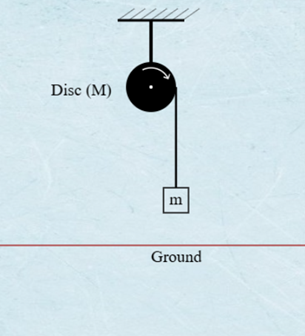

### Theory  
The experiment demonstrates the fundamental principles of rotational dynamics and the application of the work‑energy theorem in rotational motion. It involves a rigid disc mounted on a horizontal axis with a light, inextensible string wound around its circumference. A mass is suspended from the free end of the string, and upon release, the falling mass causes the disc to rotate due to the torque generated by the tension in the string.

 
<em>Figure 1: Experimental Setup for Rotational Dynamics and Work‑Energy Verification</em>

This diagram illustrates the physical setup where a mass $m$ is suspended by a string wound around a rigid disc (or pulley). The falling mass applies a tension force, creating a torque $\tau$ that causes the disc to undergo angular acceleration $\alpha$ in the direction shown. The disc's radius $r$ (the lever arm, not explicitly labeled but crucial) links the linear acceleration $a$ of the mass to the angular acceleration $\alpha$ of the disc through the kinematic constraint $a = r\alpha$. The experiment measures the relationship between this torque and the resulting angular acceleration.

---

#### 1. Newton's Second Law for Rotational Motion  
In linear motion, Newton's second law states that the net force acting on an object is proportional to its linear acceleration:

$$F = ma$$  

where $F$ is force, $m$ is mass, and $a$ is linear acceleration.  

Analogously, in rotational motion, the net torque $\tau$ acting on a rigid body is proportional to its angular acceleration $\alpha$:

$$\tau = I\alpha$$

Here, $I$ is the moment of inertia, a measure of an object's resistance to rotational acceleration, dependent on its mass distribution relative to the axis of rotation. Torque is defined as:

$$\tau = r \times F = rF\sin\theta$$

where $r$ is the lever arm (distance from the axis to the point of force application), $F$ is the applied force, and $\theta$ is the angle between $r$ and $F$. For simplicity, if the force is applied tangentially ($\theta = 90^\circ$), this reduces to:

$$\tau = rF$$

The moment of inertia $I$ for discrete particles is expressed as $I = \sum m_i r_i^2$, and for continuous bodies as $I = \int r^2 \, dm$. This experiment assumes a rigid body with constant $I$, ensuring angular acceleration depends solely on torque.

---

#### 2. Torque and Angular Acceleration in the Experimental System  
The experiment involves a rigid disc of radius $r$ mounted on a horizontal axis, with a mass $m$ suspended from a light, inextensible string wound around the disc's circumference. When the mass is released, the gravitational force $mg$ generates tension $T$ in the string, which applies a torque $\tau$ to the disc.

**Torque from Tension**  
By definition, torque is given by:

$$\tau = r \times F = rF\sin\theta$$

In this setup, the string applies force tangentially to the disc ($\theta = 90^\circ$), simplifying the torque to:

$$\tau = rT$$

From the rotational form of Newton's second law ($\tau = I\alpha$), the angular acceleration $\alpha$ of the disc is:

$$\alpha = \frac{\tau}{I} = \frac{rT}{I}$$

**Kinematic Constraint: No‑Slip Condition**  
The linear acceleration $a$ of the falling mass is related to the disc's angular acceleration by the no‑slip condition:

$$a = r\alpha$$

**Combining Linear and Rotational Dynamics**  

1. **For the falling mass** (linear motion):  
   $$mg - T = ma$$  

2. **For the disc** (rotational motion):  
   Substitute $\tau = rT = I\alpha$ and $\alpha = a/r$ to express tension $T$ as:  
   $$T = \frac{I\alpha}{r} = \frac{Ia}{r^{2}}$$  

3. **Solve for acceleration $a$:**  
   Substitute $T = Ia/r^2$ into $mg - T = ma$:  
   $$mg - \frac{Ia}{r^{2}} = ma$$  
   $$mg = a\left( m + \frac{I}{r^{2}} \right)$$  
   Rearranging gives:  
   $$a = \frac{mg}{m + \frac{I}{r^{2}}}, \quad \alpha = \frac{a}{r}$$  

This shows that the disc's moment of inertia $I$ reduces the acceleration of the falling mass compared to free fall ($a < g$).

---

#### 3. Work‑Energy Theorem in Rotational Dynamics  
The work‑energy theorem states that the net work done on a system equals its change in kinetic energy. For linear motion:

$$W = \Delta KE_{\text{linear}} = \frac{1}{2}m\left( v_f^{2} - v_i^{2} \right)$$

In rotational motion, work done by torque is defined as:

$$W = \int \tau \, d\theta$$

where $\theta$ is the angular displacement. For constant torque, this simplifies to:

$$W = \tau \Delta\theta$$

**Rotational kinetic energy** $KE_{\text{rot}}$ is given by:

$$KE_{\text{rot}} = \frac{1}{2}I\omega^{2}$$

where $\omega$ is the angular velocity. The work‑energy theorem for rotation states:

$$W = \Delta KE_{\text{rot}} = \frac{1}{2}I\left( \omega_f^{2} - \omega_i^{2} \right)$$

**Derivation**  
Starting with $W = \int \tau \, d\theta$ and substituting $\tau = I\alpha = I \frac{d\omega}{dt}$:

$$W = \int I \frac{d\omega}{dt} \, d\theta$$

Using $d\theta = \omega \, dt$, this becomes:

$$W = I \int \omega \, d\omega = \frac{1}{2}I\left( \omega_f^{2} - \omega_i^{2} \right)$$

Thus, the work done by net torque equals the change in rotational kinetic energy, assuming $I$ is constant.

---

#### 4. Energy Considerations in Rotational Motion  
The work‑energy theorem for rotational motion states that the net work done by torque is equal to the change in rotational kinetic energy:

$$W = \Delta KE_{\text{rot}} = \frac{1}{2}I\left( \omega_f^{2} - \omega_i^{2} \right)$$

where $\omega_i$ and $\omega_f$ are the initial and final angular velocities. In this experiment:

1. **Work done by torque $W_{\tau}$:** As the mass falls through height $h$, the tension $T$ in the string performs work on the disc:  
   $$W_{\tau} = \tau \Delta\theta = rT \Delta\theta$$  
   where $\Delta\theta = h/r$ (angular displacement of the disc).

2. **Change in gravitational potential energy $\Delta PE$:**  
   $$\Delta PE = mgh$$

3. **Change in kinetic energy $\Delta KE$:**  
   $$\Delta KE = \frac{1}{2}I\omega_f^{2} + \frac{1}{2}mv_f^{2} \quad \text{(rotational + translational)}$$

   By conservation of mechanical energy (assuming negligible friction):  
   $$\Delta PE = \Delta KE$$  
   $$mgh = \frac{1}{2}I\omega_f^{2} + \frac{1}{2}mv_f^{2}$$

---

#### 5. Experimental Limitations and Discrepancies  
The theoretical predictions assume ideal conditions. Discrepancies between experimental results and theory may arise due to the following limitations:

1. **Friction:** The rotational axis bearings will inevitably introduce frictional torque. This non‑conservative force performs negative work, reducing the disc's final kinetic energy relative to the expected energy conversion from potential energy.
2. **Non‑Ideal String/Pulley:** The theory assumes an inextensible and massless string, and a perfectly rigid disc. Real‑world materials deviate slightly from these assumptions.
3. **Air Resistance:** Air resistance acts on the falling mass and the rotating disc, which is not accounted for in the core equations.

---

#### 6. Theoretical Predictions for the Experiment  

**I. Torque‑Angular Acceleration Relationship**  
A rotating disk or pulley with a known $I$ will experience a torque via a tension force from a falling mass. By varying the applied torque (e.g., changing $r$ or $F$) and measuring $\alpha$ (via angular displacement sensors), the proportionality $\tau \propto \alpha$ can be tested. The slope of $\tau$ vs. $\alpha$ should equal $I$.

**II. Work‑Energy Verification**  
By calculating the work done by torque $W = \tau \Delta\theta$ and comparing it to the change in rotational kinetic energy $\Delta KE_{\text{rot}}$, the work‑energy theorem can be validated. Discrepancies may arise from non‑conservative forces (e.g., friction), which must be minimized or accounted for.

**III. Experimental Validation**  
By measuring $a$ (via time‑distance kinematics) and $\alpha$ (using angular sensors), the relationship $\tau = I\alpha$ can be tested. A plot of $\tau$ (calculated as $rT$) vs. $\alpha$ should yield a straight line with slope $I$, confirming Newton's second law for rotation.

---

### Glossary of Symbols  

| Symbol | Meaning | SI Unit | Notes/Formula |
|--------|---------|---------|---------------|
| $\tau$ | Torque | N·m (Newton-meter) | $\tau = r \times F = rF \sin\theta$ |
| $\alpha$ | Angular acceleration | rad/s² | $\alpha = \Delta\omega/\Delta t$ |
| $\omega$ | Angular velocity | rad/s | $\omega = \Delta\theta/\Delta t$ |
| $\theta$ | Angular displacement | rad (radians) | |
| $I$ | Moment of inertia | kg·m² | $I = \sum m_i r_i^2$ (discrete); $I = \int r^2 \, dm$ (continuous) |
| $r$ | Radius / lever arm | m (meters) | Distance from axis to point of force application |
| $m$ | Mass (falling object) | kg | |
| $M$ | Mass of the disc/pulley (if used) | kg | |
| $a$ | Linear acceleration of falling mass | m/s² | $a = r\alpha$ |
| $v$ | Linear velocity of falling mass | m/s | $v = r\omega$ |
| $g$ | Acceleration due to gravity | m/s² | ~9.81 m/s² |
| $T$ | Tension in the string | N (Newtons) | |
| $F$ | Force | N (Newtons) | |
| $h$ | Height through which mass falls | m (meters) | |
| $\Delta KE$ | Change in kinetic energy | J (Joules) | $\Delta KE = \frac{1}{2}mv^2 + \frac{1}{2}I\omega^2$ |
| $\Delta PE$ | Change in potential energy | J (Joules) | $\Delta PE = mgh$ |
| $W$ | Work done | J (Joules) | $W = \tau\Delta\theta$ (rotational) |
| $KE_{\text{rot}}$ | Rotational kinetic energy | J (Joules) | $KE_{\text{rot}} = \frac{1}{2}I\omega^2$ |
| $KE_{\text{tran}}$ | Translational kinetic energy | J (Joules) | $KE_{\text{tran}} = \frac{1}{2}mv^2$ |
| $t$ | Time | s (seconds) | |
| $\Delta t$ | Time interval | s (seconds) | |
| $N$ | Number of rotations | dimensionless | $N = \theta/(2\pi)$ |

---

### Key Takeaways from Equations  

1. Rotational motion mirrors linear motion: Torque drives angular acceleration just as force drives linear acceleration ($\tau = I\alpha$), with $I$ playing the role of mass.
2. The falling mass's acceleration is reduced by the disc's inertia:  
   $$a = \frac{mg}{m + \frac{I}{r^{2}}} < g$$  
   linking linear and rotational systems via $a = r\alpha$.
3. Work by torque builds rotational kinetic energy:  
   $$\tau\theta = \frac{1}{2}I\omega^{2}$$  
   verifying energy conservation when friction is negligible. These relations allow direct testing of Newton's laws and energy principles through measurable quantities like $\alpha$, $\omega$, and $h$.

---

